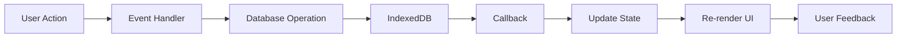

# 📋 Daily Task Tracker - Enhanced Edition

<div align="center">


[](https://developer.mozilla.org/en-US/docs/Web/HTML)
[](https://developer.mozilla.org/en-US/docs/Web/CSS)
[](https://developer.mozilla.org/en-US/docs/Web/JavaScript)
[](https://developer.mozilla.org/en-US/docs/Web/API/IndexedDB_API)
[](https://opensource.org/licenses/MIT)

**A professionally architected task tracking application with persistent database storage, GitHub-style activity heatmap visualization, and clean modular design.**

[Features](#-key-features) • [Installation](#-installation) • [Quick Start](#-quick-start) • [Architecture](#-architecture) • [Documentation](#-documentation)

---

*📊 Track daily tasks • 🔥 Build streaks • 📈 Visualize activity • 💾 Never lose data*

</div>

---

## 📋 Table of Contents

- [Overview](#-overview)
- [Key Features](#-key-features)
- [Installation](#-installation)
- [Quick Start](#-quick-start)
- [Architecture](#-architecture)
- [File Structure](#-file-structure)
- [Database Schema](#-database-schema)
- [User Interface](#-user-interface)
- [Activity Heatmap](#-activity-heatmap)
- [Browser Compatibility](#-browser-compatibility)
- [Use Cases](#-use-cases)
- [Contributing](#-contributing)
- [License](#-license)

---

## 🌟 Overview

The **Daily Task Tracker - Enhanced Edition** transforms simple to-do lists into a powerful productivity system with **IndexedDB persistence**, **GitHub-style activity visualization**, and **modular architecture** for easy maintenance.

### Why This Version?

<table>
<tr>
<td width="50%">

#### Before (localStorage)
❌ 5-10MB storage limit  
❌ Lost on browser clear  
❌ No structured queries  
❌ Synchronous operations  
❌ Simple key-value only  

</td>
<td width="50%">

#### After (IndexedDB)
✅ 50MB+ storage capacity  
✅ Persistent across sessions  
✅ SQL-like queries & indexes  
✅ Async/await operations  
✅ Structured data with relations  

</td>
</tr>
</table>

---

## ✨ Key Features

### 📊 Core Functionality

| Feature | Description |
|---------|-------------|
| ✅ **Task Management** | Create, complete, and delete tasks with categories |
| 🏷️ **Categories** | Work, Personal, Health, Learning organization |
| 📅 **Daily Tracking** | Mark tasks complete each day independently |
| 🔔 **Reminders** | Set time-based notifications with custom notes |
| 📈 **Activity Heatmap** | 20-week GitHub-style completion visualization |
| 🔥 **Streak Counter** | Track consecutive days of task completion |
| 📊 **Statistics** | Real-time completion rates and history |
| 💾 **Export/Import** | Save and load data in CSV/JSON formats |
| 📱 **Touch Gestures** | Swipe-to-delete on mobile devices |
| 🌐 **Offline First** | Works completely without internet |

### 🎨 Visual Design

- **Clean Interface**: Minimalist design focused on tasks
- **Green Theme**: Consistent color scheme throughout
- **Responsive Layout**: Mobile-first with tablet/desktop support
- **Smooth Animations**: Hover effects and transitions
- **Data Visualization**: Charts, heatmaps, and calendar views

---

## 🚀 Installation

### System Requirements

- **Browser**: Chrome 24+, Firefox 16+, Safari 10+, or Edge 12+
- **JavaScript**: Enabled (required for functionality)
- **Storage**: Minimum 10MB available space
- **Display**: 320px+ width (mobile-friendly)

### Step 1: Download Files

**Option A: Git Clone**
```bash
git clone https://github.com/yourusername/daily-task-tracker.git
cd daily-task-tracker
```

**Option B: Direct Download**
1. Download ZIP from GitHub
2. Extract to a folder
3. Navigate to extracted folder

### Step 2: Verify File Structure

```
daily-task-tracker/
├── index.html          # Main HTML structure
├── styles.css          # All styling and themes
├── script.js           # Application logic
└── database.js         # IndexedDB operations
```

### Step 3: Launch Application

**Method 1: Double-Click (Simplest)**
```bash
# Just double-click index.html
# Opens in your default browser
```

**Method 2: Local Server (Recommended)**
```bash
# Python 3
python -m http.server 8000

# Python 2
python -m SimpleHTTPServer 8000

# Node.js (with http-server)
npx http-server -p 8000

# Then open: http://localhost:8000
```

**Method 3: VS Code Live Server**
```bash
# Install "Live Server" extension
# Right-click index.html
# Select "Open with Live Server"
```

### Step 4: Verify Installation

✅ **Success Checklist:**
1. Page loads without errors
2. "Daily Task Tracker" header visible
3. Three tabs: Tasks, History, Activity
4. Can add a test task
5. Task persists after page refresh

**Test Database:**
```bash
1. Add task: "Test task"
2. Close browser completely
3. Reopen application
4. Task should still be there ✅
```

---

## 🎯 Quick Start

### 1️⃣ Add Your First Task

```plaintext
1. Find "Add a new task..." input field
2. Type: "Complete project documentation"
3. Select category: Work
4. Click "ADD" button
5. ✓ Task appears in the list!
```

### 2️⃣ Mark Task Complete

```plaintext
1. Locate your task in the list
2. Click green "Yes" button
3. Task shows ✓ checkmark
4. Statistics update automatically
5. Activity heatmap adds green square
```

### 3️⃣ Set a Reminder

```plaintext
1. Click 🔕 bell icon next to task
2. Set time: 2:30 PM
3. Add note: "Review before meeting"
4. Click "Save"
5. Bell icon changes to 🔔
6. Get notified at scheduled time!
```

### 4️⃣ View Your Activity

```plaintext
1. Click "Activity" tab at bottom
2. See 20-week history grid
3. Darker green = more tasks completed
4. Hover for exact counts
5. Today highlighted with border
```

### 5️⃣ Export Your Data

```plaintext
1. Switch to "History" tab
2. Click a task to see monthly calendar
3. Use browser back if needed
4. Data always auto-saved to database
```

---

## 🏗️ Architecture

### Modular Design

```
┌─────────────────────────────────────┐
│         index.html (200 lines)      │
│  Structure, Markup, Semantic HTML   │
└─────────────────────────────────────┘
              ↓
┌─────────────────────────────────────┐
│        database.js (400 lines)      │
│   IndexedDB Layer, CRUD Operations  │
└─────────────────────────────────────┘
              ↓
┌─────────────────────────────────────┐
│         script.js (800 lines)       │
│  Logic, Rendering, Event Handling   │
└─────────────────────────────────────┘
              ↓
┌─────────────────────────────────────┐
│        styles.css (1200 lines)      │
│   Styling, Animations, Responsive   │
└─────────────────────────────────────┘
```

### Data Flow



---

## 📁 File Structure

### `index.html` - Structure

```html
<!-- Main Container -->
<div class="container">
  
  <!-- Header with Date & Stats -->
  <div class="header">
    <h1>Daily Task Tracker</h1>
    <div class="stats-summary">0/0 Done • 0 Day Streak</div>
  </div>
  
  <!-- Task View -->
  <div id="tasksView">
    <div class="filter-group">
      <button data-filter="all">All</button>
      <button data-filter="work">Work</button>
      <!-- More filters -->
    </div>
    
    <div class="add-task">
      <input id="taskInput" placeholder="Add task...">
      <select id="categorySelect">...</select>
      <button id="addBtn">Add</button>
    </div>
    
    <div id="tasksList">
      <!-- Tasks rendered here -->
    </div>
  </div>
  
  <!-- History View -->
  <div id="historySection">
    <!-- Task history with stats -->
  </div>
  
  <!-- Activity Heatmap View -->
  <div id="activitySection">
    <div class="activity-heatmap">
      <!-- 20-week grid generated by JS -->
    </div>
  </div>
  
  <!-- Bottom Navigation -->
  <div class="bottom-nav">
    <button id="navTasks">Tasks</button>
    <button id="navHistory">History</button>
    <button id="navActivity">Activity</button>
  </div>
</div>
```

### `database.js` - Storage

```javascript
// Database Configuration
const DB_NAME = 'DailyTaskTrackerDB';
const DB_VERSION = 1;

// Three Object Stores:
// 1. tasks - Main task data
// 2. history - Daily completion records  
// 3. reminders - Notification settings

// Exported API
window.DB = {
  init: initDatabase,
  tasks: {
    add, getAll, getById, update, delete
  },
  history: {
    add, getAll, getByTaskId, deleteByTaskId
  },
  reminders: {
    set, get, getAll, delete
  }
};
```

### `script.js` - Logic

```javascript
// State Management
let tasks = [];
let allHistory = [];
let allReminders = [];
let currentFilter = 'all';

// Core Functions
- addTask()           // Create new task
- markTask()          // Mark complete/failed
- deleteTask()        // Remove task
- renderTasks()       // Display filtered tasks
- updateStats()       // Calculate statistics
- renderActivityHeatmap()  // Generate 20-week grid
- checkReminders()    // Check scheduled notifications
```

### `styles.css` - Design

```css
/* CSS Variables */
:root {
  --bg: #fafaf9;
  --card: #ffffff;
  --accent: #2c2c2c;
  --success: #16a34a;
  
  /* Heatmap Colors */
  --heatmap-level-1: #9be9a8;
  --heatmap-level-2: #40c463;
  --heatmap-level-3: #30a14e;
  --heatmap-level-4: #216e39;
}

/* Key Components */
.task-row { /* Task styling */ }
.heatmap-cell { /* Heatmap squares */ }
.modal { /* Popup dialogs */ }
.bottom-nav { /* Navigation bar */ }
```

---

## 🗄️ Database Schema

### Tasks Store

```javascript
{
  id: 1733584920123,              // Primary key (timestamp)
  text: "Complete documentation", // Task description
  category: "work",               // work|personal|health|learning
  status: "pending",              // pending|completed|failed
  createdAt: "2024-12-07T10:30:00Z"
}

// Indexes: category, createdAt
```

### History Store

```javascript
{
  id: 1,                          // Auto-increment primary key
  taskId: 1733584920123,          // Foreign key to tasks
  date: "2024-12-07T10:30:00Z",   // When marked complete
  status: "completed"             // completed|failed
}

// Indexes: taskId, date, status
```

### Reminders Store

```javascript
{
  taskId: 1733584920123,          // Primary key (one per task)
  time: "2024-12-07T14:30:00Z",   // Scheduled notification time
  note: "Review before meeting",  // Optional reminder note
  notified: false                 // Has notification fired?
}

// Indexes: time
```

---

## 🖥️ User Interface

### Main Layout

```
┌──────────────────────────────────────┐
│  Daily Task Tracker        📊 0/5    │
│  Sunday, December 07, 2025           │
│  0 Day Streak                        │
├──────────────────────────────────────┤
│  [All] [Work] [Personal] [Health]   │
├──────────────────────────────────────┤
│  Add task... [Category▼]  [ADD]     │
├──────────────────────────────────────┤
│  ┌────────────────────────────────┐ │
│  │ ✓ Complete documentation  🔔   │ │
│  │   Work         [Yes] [No]      │ │
│  ├────────────────────────────────┤ │
│  │ ○ Review pull requests     🔕  │ │
│  │   Work         [Yes] [No]      │ │
│  └────────────────────────────────┘ │
├──────────────────────────────────────┤
│  [Tasks] [History] [Activity]       │
└──────────────────────────────────────┘
```

### Activity Heatmap

```
20-Week Activity Grid (GitHub-style)

Dec ■ ■ ■ ■ ■ ■ ■
Nov ■ ■ ■ ■ ■ ■ ■
Oct ■ ■ ■ ■ ■ ■ ■

■ = completed tasks
Darker = more tasks
```

### Color Coding

| Color | Usage |
|-------|-------|
| 🟢 #4CAF50 | Primary actions, success |
| 🟢 #90EE90 | Light success, completed |
| ⚪ #fafaf9 | Background |
| ⚫ #2c2c2c | Text, borders |
| 🔴 #dc2626 | Delete actions |

---

## 📊 Activity Heatmap

### How It Works

```javascript
// 1. Aggregate completed tasks by date
activityByDate = {
  "Dec 1": 3,   // 3 tasks completed
  "Dec 2": 5,   // 5 tasks completed
  "Dec 3": 0,   // No tasks
  "Dec 4": 2    // 2 tasks completed
}

// 2. Calculate intensity levels (0-4)
level 0: No activity (gray)
level 1: 1-25% of max (light green)
level 2: 26-50% of max (medium green)
level 3: 51-75% of max (dark green)
level 4: 76-100% of max (darkest green)

// 3. Generate 140 cells (20 weeks × 7 days)
for (let day = 0; day < 140; day++) {
  createHeatmapCell(date, count, level);
}
```

### Visual Guide

```
Legend: Less ■ ■ ■ ■ ■ More

Hover for details:
"Dec 7: 3 completed"

Today highlighted with border
```

---

## 🌐 Browser Compatibility

### Fully Supported ✅

| Browser | Minimum Version | Features |
|---------|----------------|----------|
| Chrome | 24+ | All features |
| Firefox | 16+ | All features |
| Safari | 10+ | All features |
| Edge | 12+ | All features |
| Opera | 15+ | All features |

### Feature Support

| Feature | Chrome | Firefox | Safari | Edge |
|---------|--------|---------|--------|------|
| IndexedDB | ✅ | ✅ | ✅ | ✅ |
| Notifications | ✅ | ✅ | ✅ | ✅ |
| Touch Events | ✅ | ✅ | ✅ | ✅ |
| CSS Grid | ✅ | ✅ | ✅ | ✅ |
| Local Storage | ✅ | ✅ | ✅ | ✅ |

### Testing

```bash
# Test in multiple browsers
1. Chrome (latest)
2. Firefox (latest)
3. Safari (macOS/iOS)
4. Edge (Windows)

# Test responsive design
1. Desktop (1920x1080)
2. Tablet (768x1024)
3. Mobile (375x667)
```

---

## 💡 Use Cases

### 1. Daily Habit Tracking

**Scenario**: Build consistent daily habits

```plaintext
Morning Routine:
- Exercise (Health category)
- Meditation (Personal)
- Review goals (Personal)

Track completion daily
Build streaks
Visualize progress in heatmap
```

### 2. Work Task Management

**Scenario**: Manage professional tasks

```plaintext
Work Tasks:
- Code review (Work)
- Team meeting (Work)
- Documentation (Work)

Set reminders for deadlines
Track completion rates
Export reports for reviews
```

### 3. Learning Goals

**Scenario**: Track study progress

```plaintext
Learning Tasks:
- Read chapter (Learning)
- Practice coding (Learning)
- Watch tutorial (Learning)

Monitor consistency
Build study streaks
Visualize learning patterns
```

### 4. Health & Fitness

**Scenario**: Track wellness activities

```plaintext
Health Tasks:
- Drink 8 glasses water (Health)
- 30min exercise (Health)
- 8 hours sleep (Health)

Daily tracking
Health streak motivation
Pattern identification
```

---

## 🤝 Contributing

### How to Contribute

1. **Fork the Repository**
2. **Create Feature Branch**
   ```bash
   git checkout -b feature/new-feature
   ```
3. **Make Changes**
4. **Test Thoroughly**
5. **Submit Pull Request**

### Code Style

```javascript
// Use async/await
async function addTask() {
  await DB.tasks.add(task);
}

// Use descriptive names
function renderActivityHeatmap() { }

// Add comments
// Calculate streak based on consecutive days
function calculateStreak() { }
```

### What We're Looking For

- ✅ Bug fixes
- ✅ New features
- ✅ UI/UX improvements
- ✅ Performance optimizations
- ✅ Documentation enhancements
- ✅ Test coverage
- ✅ Accessibility improvements

---

## 📄 License

MIT License - See LICENSE file for details

---

## 🙏 Acknowledgments

- IndexedDB API documentation
- GitHub's activity contribution graph inspiration
- Open source community
- All contributors and users

---

## 📞 Support

- 📖 Documentation: This README
- 🐛 Issues: GitHub Issues
- 💡 Discussions: GitHub Discussions
- ⭐ Star if useful!

---

<div align="center">

**Made with ❤️ for productivity enthusiasts**

[⬆ Back to Top](#-daily-task-tracker---enhanced-edition)

</div>
